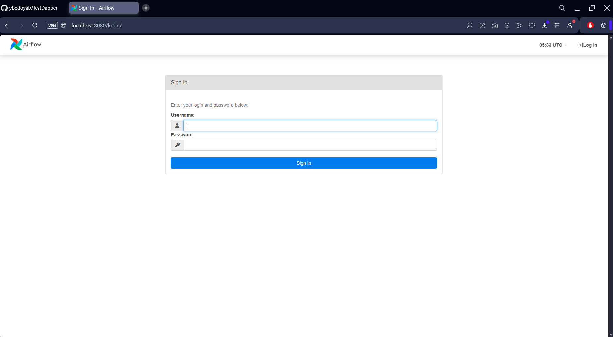
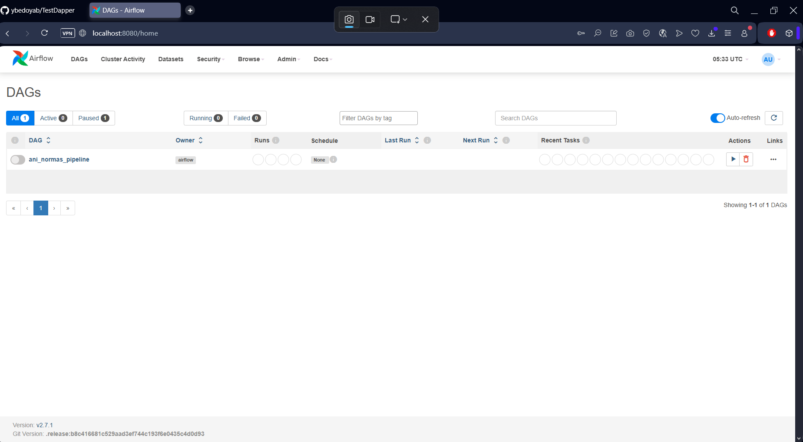
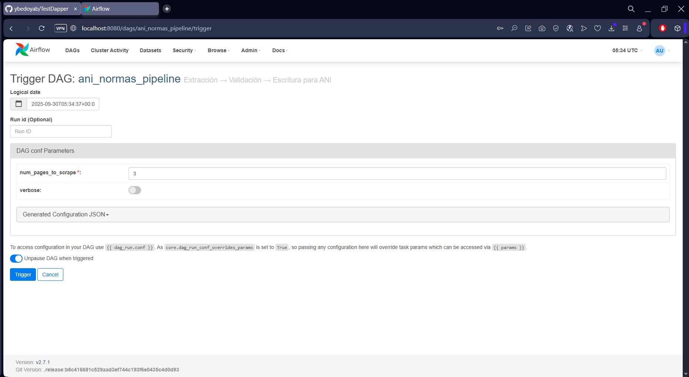
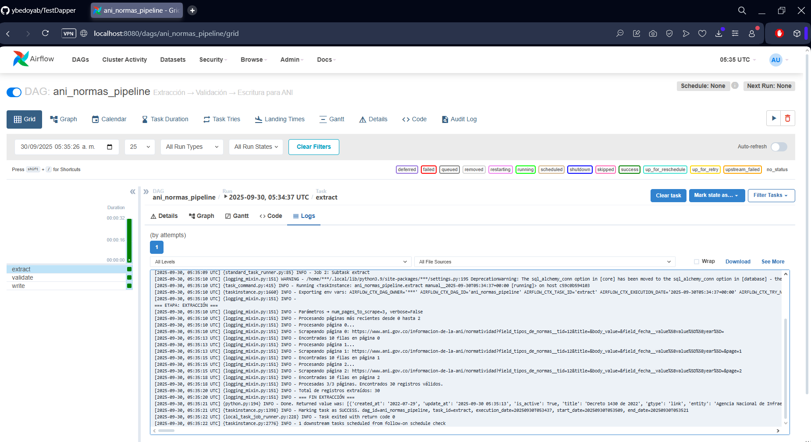
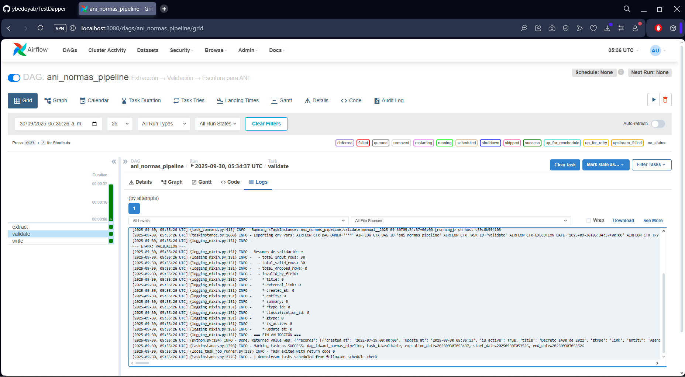
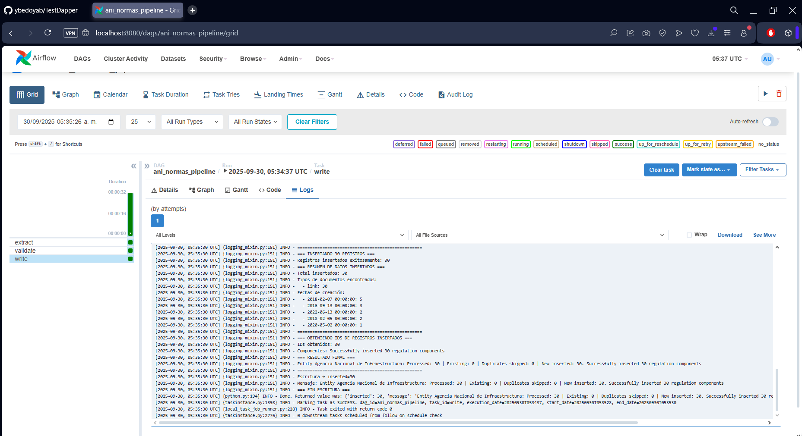
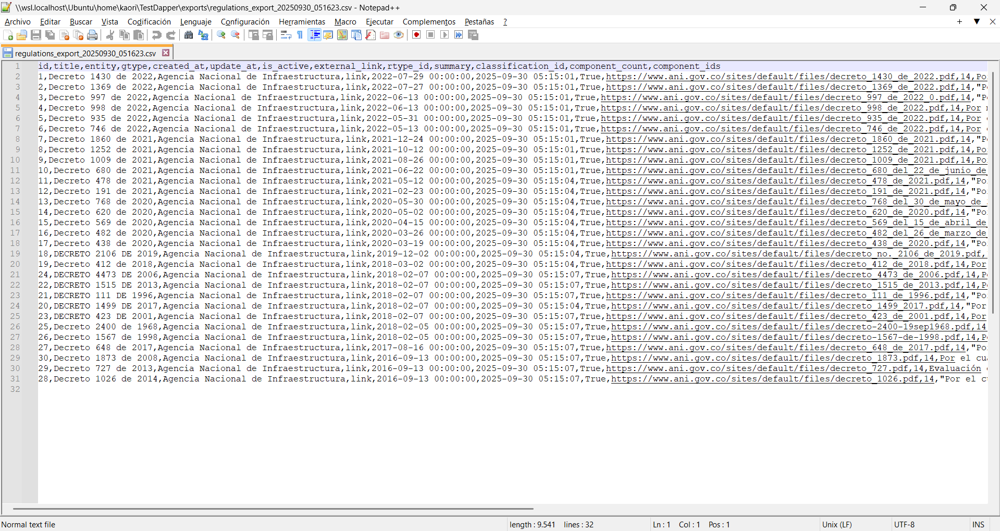
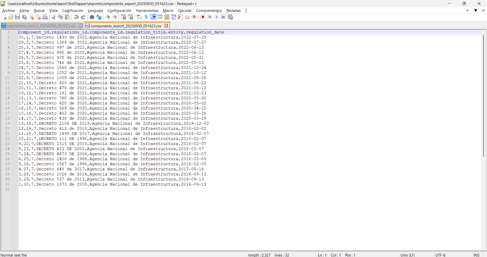

# 📸 Guía Visual del Proceso - TestDapper

Esta guía muestra paso a paso cómo ejecutar el pipeline de extracción, validación y escritura de normativas usando Apache Airflow.

## 🎯 Objetivo
Demostrar el funcionamiento completo del sistema de scraping de normativas de la Agencia Nacional de Infraestructura (ANI) a través de la interfaz de Airflow.

---

## 📋 Pasos del Proceso

### Paso 1: Acceso al Sistema
**Imagen:** 

1. **Abrir navegador** y acceder a `http://localhost:8080/login/`
2. **Credenciales de acceso:**
   - **Usuario:** `admin`
   - **Contraseña:** `admin`
3. **Hacer clic en "Sign In"** para acceder al sistema

---

### Paso 2: Navegación a DAGs
**Imagen:** 

1. **Localizar el DAG:** `ani_normas_pipeline`
2. **Estado inicial:** El DAG aparece **pausado** (toggle switch desactivado)
3. **Acciones disponibles:**
   - ▶️ **Play button:** Para ejecutar el DAG
   - ⏸️ **Pause button:** Para pausar el DAG
   - 🗑️ **Delete button:** Para eliminar el DAG

---

### Paso 3: Configurar Parámetros
**Imagen:** 

1. **Hacer clic en el nombre del DAG** `ani_normas_pipeline`
2. **Ir a la pestaña "Trigger DAG with config"**
3. **Configurar parámetros:**
   ```json
   {
     "num_pages_to_scrape": 3,
     "verbose": false
   }
   ```
4. **Hacer clic en "Trigger"** para iniciar la ejecución

**📝 Nota:** Los parámetros controlan cuántas páginas se van a scrapear y si se muestran logs detallados.

---

### Paso 4: Ejecución de Extracción
**Imagen:** 

1. **Monitorear la tarea "extract"**
2. **Estado esperado:** ✅ **Success** (verde)
3. **Logs importantes a verificar:**
   ```
   === ETAPA: EXTRACCIÓN ===
   Parámetros → num_pages_to_scrape=3, verbose=false
   Total de registros extraídos: 30
   === FIN EXTRACCIÓN ===
   ```

---

### Paso 5: Ejecución de Validación
**Imagen:** 

1. **Monitorear la tarea "validate"**
2. **Estado esperado:** ✅ **Success** (verde)
3. **Logs importantes a verificar:**
   ```
   === ETAPA: VALIDACIÓN ===
   Resumen de validación →
     - total_input_rows: 30
     - total_valid_rows: 29
     - total_dropped_rows: 1
     - invalid_by_field:
       * title: 1
   === FIN VALIDACIÓN ===
   ```

---

### Paso 6: Ejecución de Escritura
**Imagen:** 

1. **Monitorear la tarea "write"**
2. **Estado esperado:** ✅ **Success** (verde)
3. **Logs importantes a verificar:**
   ```
   === ETAPA: ESCRITURA ===
   === EJEMPLOS DE DATOS A INSERTAR ===
     1. Título: Decreto 1430 de 2022...
        Fecha: 2022-07-29 00:00:00
        Tipo: link
   
   === RESUMEN DE DATOS INSERTADOS ===
   Total insertados: 29
   Tipos de documentos encontrados:
     - link: 29
   
   Entity Agencia Nacional de Infraestructura: 
   Processed: 30 | Existing: 0 | Duplicates skipped: 1 | 
   New inserted: 29. Successfully inserted 29 regulation components
   === FIN ESCRITURA ===
   ```

---

### Paso 7: Verificación de Datos - Regulaciones
**Imagen:** 

1. **Ejecutar comando de verificación:**
   ```bash
   make view-regulations
   ```
2. **Resultado esperado:**
   ```
   === ÚLTIMAS 10 REGULACIONES ===
   id |        title         |               entity                | gtype |     created_at      
   ----+----------------------+-------------------------------------+-------+---------------------
     1 | Decreto 1430 de 2022 | Agencia Nacional de Infraestructura | link  | 2022-07-29 00:00:00
     2 | Decreto 1369 de 2022 | Agencia Nacional de Infraestructura | link  | 2022-07-27 00:00:00
     ...
   ```

---

### Paso 8: Verificación de Datos - Componentes
**Imagen:** 

1. **Ejecutar comando de verificación:**
   ```bash
   make view-components
   ```
2. **Resultado esperado:**
   ```
   === COMPONENTES DE REGULACIONES ===
   id |        title         |               entity                | components_id 
   ----+----------------------+-------------------------------------+---------------
    29 | Decreto 1430 de 2022 | Agencia Nacional de Infraestructura |             7
    28 | Decreto 1369 de 2022 | Agencia Nacional de Infraestructura |             7
     ...
   ```

---
